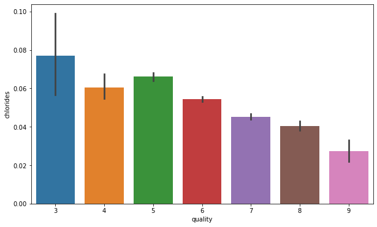
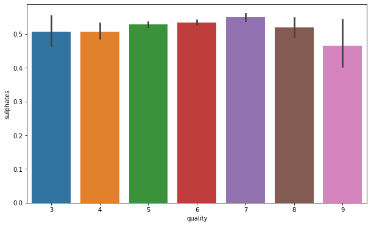
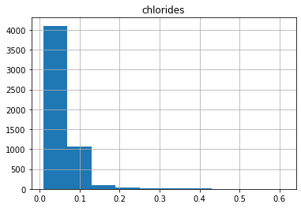

# WineQuality

**_Abstract_**

This project centers around creating a regression ML model based on data of specific physiochecmical properties of Portuguese white and red wines to predict the quality of each wine on a 0-10 scale. In order to create the best model for this specific data, the main objective was to generate a model in Python using Scikit-Learn with Pandas, Numpy, and Scipy for data preprocessing and to determine the most important features for modeling via data visualization using Matplotlib and Seaborn and feature selection tools. After preprocessing and creating models, the data was executed through 6 different machine learning regression models and parameters were hypertuned to determine which model performs the best and is most appropriate for this data.

**_Methodology:_** Data

Both red and wine data was sourced from the University of California, Irvine Machine Learning Repository. Attributes included from physiochemical tests:
* Fixed Acidity
* Volatile Acidity
* Citric Acid 
* Residual Sugar 
* Chlorides
* Free Sulfur Dioxide
* Total Sulfur Dioxide
* Density
* pH
* Sulphates
* Alcohol
* Quality: Score given between 0 and 10 by testers based on sensory data


**_Methodology:_** Preprocessing


* **_Removing Missing (NA) Values:_**
Both CSV files had 0 missing values
```python
df3.isnull().sum()
```

* **_Removing Duplicate Values:_**
Duplicate values were dropped

```python
df1.drop_duplicates(inplace=True)
df2.drop_duplicates(inplace=True)
df3 = df1.append(df2, ignore_index=True)
```

* **_Removing Outlier Values:_**
Outlier detection using z-score method was employed and records with a z-score greater than 3 were dropped

```python
z_scores = stats.zscore(df3)
abs_z_scores = np.abs(z_scores)
filtered = (abs_z_scores < 3).all(axis=1)
df4 = pd.DataFrame(df3[filtered])
df4.shape
```

* **_Feature Normalization:_**
Feature normalization using Scikit-Learn's scaler to remove mean and scale features to unit variance

```python
df5=df4
df5_columns=list(df5.columns.values)
from sklearn.preprocessing import StandardScaler
scaler=StandardScaler()
scaler.fit(df5)
df6=scaler.transform(df5)
df6=pd.DataFrame(df6, columns=df5_columns)
df6
```


**_Methodology:_** Feature Selection 

* **_Visualization:_**
  * Barplots: Barplots were used in order to visualize relation between each attribute and quality rating








  * Histograms & Density Plots: Both histograms and density plots were used for more in depth understanding of the distribution of values within each attribute
  * For further visualization for features whose correlation to target feature is unclear with histograms and barplot
  
  * Histograms





* Density Plots


  * Correlation Matrix & Heatmap: Correlation matrix and heatmap were utilized to compute a pairwise comparison of columns and retreieve correlation coefficient to narrow down which features to use for model creation


* **_Feature Selection:_**
Using Scikit-Learn's Select K Best algorithm, the top 5 most important features in relation to the target variable were returned 


```python
a=df6.loc[:, df6. columns != 'quality']
b=df6['quality']
from sklearn.feature_selection import SelectKBest
selector = SelectKBest(k =5)
selector.fit(a,b)
a.columns[selector.get_support()]
```

**_Methodology:_** Machine Learning 

Using top features selected from interpretation of relation between variables from data visualization and features selected from selection algorithms, models were created and the best performing model was determined

* **_Models:_**

```python
from sklearn.model_selection import train_test_split
X_train, X_test, y_train, y_test = train_test_split(X,y,test_size=0.2, random_state=10)
```
_Testing 5 different ML Regression models to determine apt model_

**Linear Regression**
```python
lr_clf=LinearRegression(normalize=True)
lr_clf.fit(X_train,y_train)
y_pred=lr_clf.predict(X_test)
y_true=y_test
mse_lr=mean_squared_error(y_true, y_pred)
mae_lr=mean_absolute_error(y_true, y_pred)
r2_lr=r2_score(y_true, y_pred)
```

**Ridge Regression**
```python
clf = Ridge(alpha=1.0)
clf.fit(X_train, y_train)
y_pred=clf.predict(X_test)
y_true=y_test
mse_r=mean_squared_error(y_true, y_pred)
mae_r=mean_absolute_error(y_true, y_pred)
r2_r=r2_score(y_true, y_pred)
```

**Lasso Regression**
```python
las = Lasso(alpha=0.1)
las.fit(X_train, y_train)
y_pred=las.predict(X_test)
y_true=y_test
mse_l=mean_squared_error(y_true, y_pred)
mae_l=mean_absolute_error(y_true, y_pred)
r2_l=r2_score(y_true, y_pred)
```
**Random Forest Regressor**
```python
regr = RandomForestRegressor(max_depth=2, random_state=0)
regr.fit(X_train, y_train)
regr.score(X_test, y_test)
y_pred=regr.predict(X_test)
y_true=y_test
mse_rf=mean_squared_error(y_true, y_pred)
mae_rf=mean_absolute_error(y_true, y_pred)
r2_rf=r2_score(y_true, y_pred)
```
**K-Nearest Neighbors Regressor**
```python
knn=KNeighborsRegressor(n_neighbors=20)
knn.fit(X_train, y_train)
knn.score(X_test, y_test)
y_pred=knn.predict(X_test)
y_true=y_test
mse_knn=mean_squared_error(y_true, y_pred)
mae_knn=mean_absolute_error(y_true, y_pred)
r2_knn=r2_score(y_true, y_pred)
```


* **_Metrics:_**
Dataframe with metrics such as MSE (Mean Squared Error), MAE (Mean Absolute Error), and R-squared model score. This original evaluation of metrics show the K-Nearest Neighbors Regressor to be performing the best out of the 5 models
```python

data=[['Linear Regression', mse_lr,  mae_lr, r2_lr], ['Ridge', mse_r, mae_r, r2_lr], 
     ['Lasso', mse_l,  mae_l, r2_l], ['Random Forest Regressor', mse_rf,  mae_rf, r2_rf],
     ['K Nearest Neighbor', mse_knn, mae_knn, r2_knn]]
metrics_df=pd.DataFrame(data, columns=['Model', 'Mean Squared Error',
                                       'Mean Absolute Error', 'R2 Score'])
metrics_df
```


* **_Hyperparameter Tuning:_**
Used GridSearchCV in order to find best parameters for each model and to gain an understanding of which model outperforms the rest 

```python

def find_best_model_using_gridsearchcv(X,y):
    algos={
        'linear regression': {
            'model': LinearRegression(),
            'params':{
                'normalize': [True, False]
                
            }
        }, 
        'KNN':{
            'model': KNeighborsRegressor(),
            'params': {
                'n_neighbors': [3,5,11,19],
                'weights': ['uniform', 'distance'],
                'metric': ['euclidean', 'manhattan']
                
            }
        },
        'Ridge':{
            'model': Ridge(),
            'params':{
                'alpha': [1,0.1,0.01,0.001,0.0001,0] ,
                'fit_intercept': [True, False],
                'solver': ['svd', 'cholesky', 'lsqr', 'sparse_cg', 'sag', 'saga']
            }
        }, 
        'Lasso':{
            'model':Lasso(), 
            'params':{
                'alpha': (np.logspace(-8, 8, 100))
            }
        },
        'Random Forest':{
            'model':RandomForestRegressor(), 
            'params':{
                'n_estimators': [200, 500],
                'max_features': ['auto', 'sqrt', 'log2'],
                'max_depth' : [4,5,6,7,8]
            }
        }
                
    }
    scores=[]
    cv=ShuffleSplit(n_splits=5, test_size=0.2, random_state=0)
    for algo_name, config in algos.items():
        gs=GridSearchCV(config['model'], config['params'], cv=cv, return_train_score=False)
        gs.fit(X,y)
        scores.append({
            'model': algo_name, 
            'best_score': gs.best_score_, 
            'best_params': gs.best_params_
        })
    return pd.DataFrame(scores, columns=['model', 'best_score', 'best_params'])
```


* **_Results:_**
Determined from grid search parameter tuning function that with optimally tuned parameters, the Random Forest Regressor outperformed the other models and is the best choice for regression analysis for this particular data set.

Tuned RF Regressor
```python

regr = RandomForestRegressor(max_depth=8, max_features='log2',n_estimators=500,random_state=0)
regr.fit(X_train, y_train)
regr.score(X_test, y_test)
y_pred=regr.predict(X_test)
y_true=y_test
mse_rf2=mean_squared_error(y_true, y_pred)
mae_rf2=mean_absolute_error(y_true, y_pred)
r2_rf2=r2_score(y_true, y_pred)
```
```python

y_pred=regr2.predict(X_test)
comp_df = pd.DataFrame({'Actual': y_test, 'Predicted': y_pred})
```
